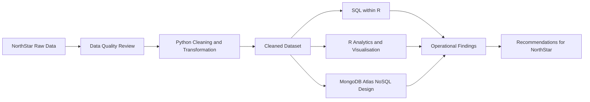
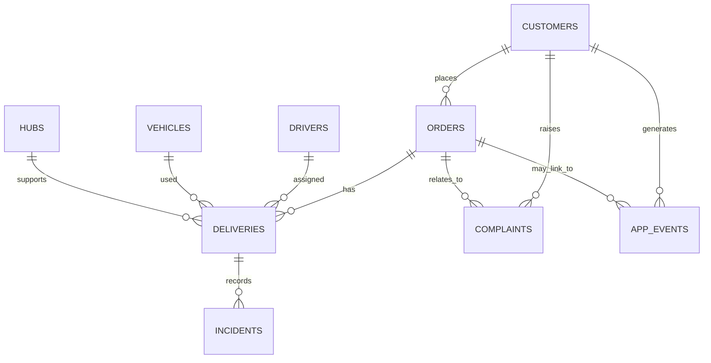

# NorthStar Urban Mobility and Logistics

**Databases and Analytics Coursework Repository**

## Project Overview

This repository supports the **Databases and Analytics** coursework for the NorthStar Urban Mobility and Logistics case study. NorthStar operates transport and shuttle services, last-mile delivery, warehouse and dispatch hubs, electric vehicle charging infrastructure, and mobile platforms for customers and drivers.

The assignment focuses on using data to explain why operational performance is deteriorating, why complaints, delays, and failures occur, why costs and inefficiencies vary across routes, hubs, and services, and how NorthStar's data architecture can better support decision-making.

The repository contains raw data, cleaned data, and notebooks for Python, R/SQL, and MongoDB Atlas work.

## Repository Structure

| Location | Contents | Assignment Purpose |
| --- | --- | --- |
| [`dataset/`](dataset/) | Original raw CSV files | Starting point for data overview, quality checks, relationship discovery, and problem identification. |
| [`cleaned_dataset/`](cleaned_dataset/) | Cleaned CSV files | Prepared data for analysis, SQL queries, MongoDB loading, charts, and final interpretation. |
| [`notebooks/`](notebooks/) | Python, R/SQL, and MongoDB notebooks | Executable coursework evidence showing processing, analysis, querying, and optimisation. |
| Folder `README.md` files | Documentation for each major folder | Helps the repository remain clear, reproducible, and easy to review. |

## Assignment Requirements Covered

| Coursework Requirement | Where It Is Addressed |
| --- | --- |
| Problem understanding | Repository overview, dataset descriptions, and notebook interpretations. |
| Data overview | `dataset/README.md`, `data_dictionary.csv`, and schema summaries. |
| Data quality and integration challenges | Raw dataset notes and Python cleaning workflow. |
| SQL within R | `North_Start_DBA_Case_study_R.ipynb` uses SQLite and SQL queries inside R. |
| R analytics and visualisation | R notebook includes statistical summaries, comparisons, and analytical interpretation. |
| Python data processing | Python notebook performs import, EDA, cleaning, integration, derived columns, statistics, and visualisation. |
| MongoDB Atlas NoSQL design | MongoDB notebook loads cleaned data, creates collections, performs CRUD, aggregation, and indexing. |
| Query optimisation | R and MongoDB notebooks include indexing and optimisation concepts. |
| GitHub reproducibility | Repository is structured with data folders, notebooks, and Markdown documentation. |

## NorthStar Business Questions

The coursework is not just a tool demonstration. The analysis is organised around the case study's business problems:

| Business Question | Relevant Data |
| --- | --- |
| Why are delays and failures occurring? | `orders`, `deliveries`, `drivers`, `vehicles`, `hubs`, `incidents` |
| Why are complaints increasing? | `complaints`, `orders`, `deliveries`, `customers`, `app_events` |
| Why do costs vary across routes, hubs, and services? | `deliveries`, `orders`, `vehicles`, `hubs` |
| Which zones, services, or operational areas show the highest risk? | Zone fields across customers, orders, deliveries, vehicles, hubs, and app events |
| How can data architecture support better decisions? | Relational SQL analysis plus MongoDB modelling for complaints, exceptions, and event histories |

## Dataset Inventory

| Dataset | Records | Main Role in the Case Study |
| --- | ---: | --- |
| `customers.csv` | 650 | Customer profile, zone, loyalty, app engagement, channel preference, and account status. |
| `orders.csv` | 1,250 | Service orders across passenger, parcel, retail, medical, and business operations. |
| `deliveries.csv` | 950 | Dispatch, delivery outcome, route distance, proof of completion, ratings, and cost. |
| `drivers.csv` | 170 | Driver experience, training, ratings, employment type, and shift preference. |
| `vehicles.csv` | 120 | Fleet type, battery health, odometer, maintenance status, and telematics version. |
| `hubs.csv` | 8 | Dispatch, warehouse, charging, and control hubs across operating zones. |
| `incidents.csv` | 280 | Operational exceptions such as route deviations, proof issues, faults, and safety events. |
| `complaints.csv` | 320 | Customer complaints, severity, status, resolution time, and compensation. |
| `app_events.csv` | 640 | Customer platform events such as route search, order tracking, ETA refresh, chat, and payment retry. |
| `data_dictionary.csv` | 9 | File-level record counts and dataset descriptions. |

## Data Relationships

Some app events are not attached to an order. For example, a customer can search a route or open chat before placing an order, so blank `app_events.order_id` values are expected.

## Notebook Workflow

| Notebook | Main Contribution |
| --- | --- |
| [`North_Start_DBA_Case_study_Python.ipynb`](notebooks/North_Start_DBA_Case_study_Python.ipynb) | Cleans and transforms data, explores missing values, creates integrated views, performs statistical analysis, and produces visual evidence. |
| [`North_Start_DBA_Case_study_R.ipynb`](notebooks/North_Start_DBA_Case_study_R.ipynb) | Creates SQLite tables, runs SQL within R, demonstrates CRUD, performs aggregate and analytical queries, and supports business interpretation. |
| [`North_Start_DBA_Case_study_MongoDB.ipynb`](notebooks/North_Start_DBA_Case_study_MongoDB.ipynb) | Demonstrates MongoDB Atlas collection loading, document operations, aggregation queries, and indexing for NoSQL analysis. |

## Recommended Review Order

1. Start with [`dataset/README.md`](dataset/README.md) to understand the raw case study data.
2. Review [`cleaned_dataset/README.md`](cleaned_dataset/README.md) to understand cleaning outputs and remaining valid blanks.
3. Inspect the Python notebook for data processing and exploratory analysis.
4. Inspect the R notebook for SQL within R, relational querying, analytics, and visualisation.
5. Inspect the MongoDB notebook for NoSQL design, querying, and indexing.

## Notes

- The cleaned files preserve the same record counts as the raw files.
- Raw data includes missing values and inconsistent zone naming, which are part of the data quality challenge.
- The repository is designed to support a coursework report where every technical output should be interpreted in business terms.
