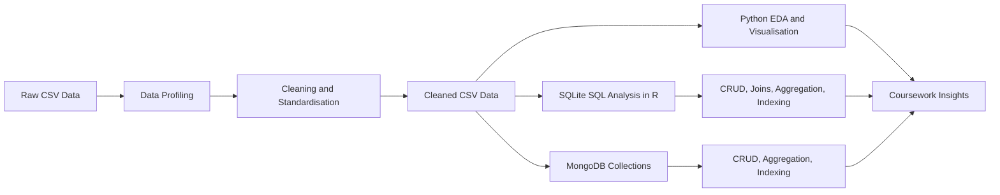
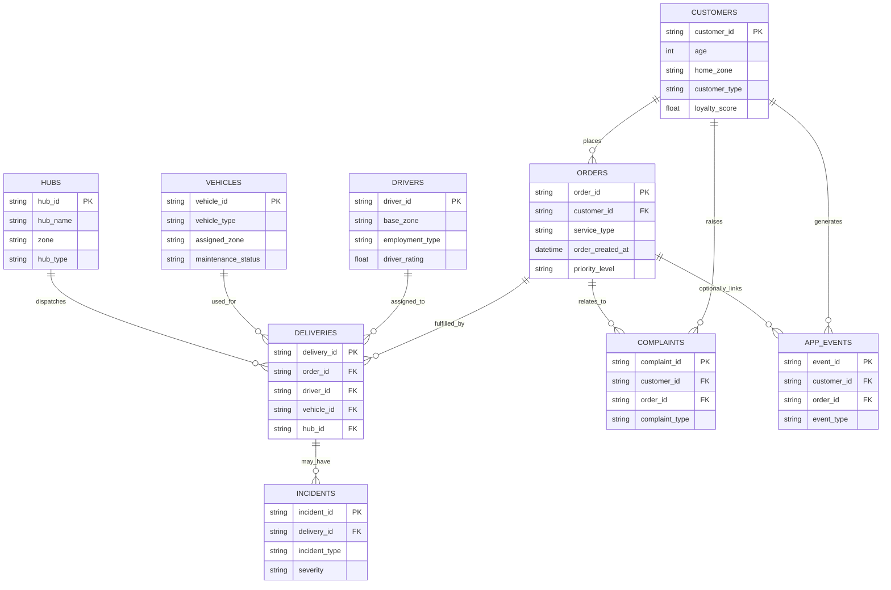
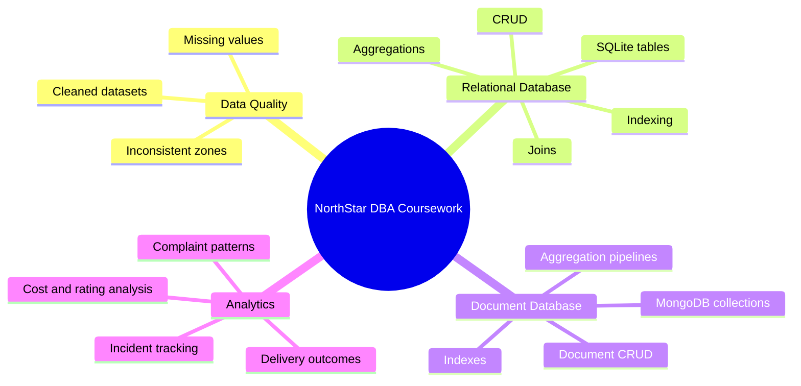

# NorthStar DBA Coursework

**Database administration case study for a mobility and logistics operation**

## Project Snapshot

NorthStar is a DBA coursework case study built around a mobility and logistics business. The repository contains raw operational data, cleaned datasets, and notebooks that demonstrate how the data can be profiled, cleaned, loaded, queried, analysed, and optimised across relational and document database environments.

The case study covers customers, orders, deliveries, drivers, vehicles, hubs, incidents, complaints, and digital app events.

## Repository Map

| Location | What It Contains | Coursework Purpose |
| --- | --- | --- |
| [`dataset/`](dataset/) | Original raw CSV files | Source data for profiling, data quality review, schema discovery, and baseline comparison. |
| [`cleaned_dataset/`](cleaned_dataset/) | Cleaned CSV files | Prepared data for SQL, MongoDB, reporting, joins, and analysis. |
| [`notebooks/`](notebooks/) | Python, R/SQL, and MongoDB notebooks | Executable evidence of data cleaning, database operations, analytics, and optimisation. |
| [`README.md`](README.md) files | Folder-level documentation | Clear explanation of the dataset, workflow, and assignment evidence. |

## Coursework Scope

| DBA Area | Repository Evidence |
| --- | --- |
| Data understanding | Raw datasets, data dictionary, schema summaries, and relationship mapping. |
| Data quality review | Missing-value checks, inconsistent category values, and raw-to-cleaned comparison. |
| Data preparation | Cleaned CSV files with standardised zones and handled missing values. |
| Relational database work | R notebook using SQLite tables, joins, CRUD operations, aggregation, and optimisation. |
| NoSQL database work | MongoDB notebook using collections, document insertion, CRUD, aggregation, and indexing. |
| Analytical reporting | Python and R analysis covering delivery performance, complaints, incidents, costs, ratings, and zone-level patterns. |

## Dataset Inventory

The case study contains nine business datasets plus one data dictionary.

| Dataset | Records | Entity | Main Use |
| --- | ---: | --- | --- |
| `customers.csv` | 650 | Customer | Customer profile, loyalty, engagement, preferred channel, and account status. |
| `orders.csv` | 1,250 | Order | Service requests, priorities, zones, booking channels, values, and handling flags. |
| `deliveries.csv` | 950 | Delivery | Dispatch performance, completion outcomes, route distance, ratings, and cost. |
| `drivers.csv` | 170 | Driver | Workforce details, training score, rating, shift preference, and activity status. |
| `vehicles.csv` | 120 | Vehicle | Fleet type, battery health, odometer, maintenance status, and telematics version. |
| `hubs.csv` | 8 | Hub | Operational hubs, zones, hub types, and capacity scores. |
| `incidents.csv` | 280 | Incident | Delivery and operational incident tracking. |
| `complaints.csv` | 320 | Complaint | Customer complaints, severity, resolution status, and compensation. |
| `app_events.csv` | 640 | Digital Event | App activity suitable for MongoDB-style document modelling. |
| `data_dictionary.csv` | 9 | Metadata | File-level record counts and dataset descriptions. |

## Data Model

Some app events are not tied to a specific order, so `app_events.order_id` can be blank. This is expected for events such as route searches, chat interactions, or app usage before an order is created.

## Analysis Workflow

| Stage | Tool | Output |
| --- | --- | --- |
| Raw data inspection | Python / Pandas | Dataset shape, schema review, missing-value checks, categorical review. |
| Data cleaning | Python / Pandas | Standardised zones, handled missing values, derived fields, cleaned CSV files. |
| Relational modelling | R / SQLite | Tables, SQL CRUD operations, joins, aggregation, and query optimisation. |
| Document modelling | MongoDB Atlas / PyMongo | Collections, document CRUD, aggregation, and indexing. |
| Reporting | Python / R | Operational and business insights for the coursework submission. |

## Notebook Guide

| Notebook | Focus |
| --- | --- |
| [`North_Start_DBA_Case_study_Python.ipynb`](notebooks/North_Start_DBA_Case_study_Python.ipynb) | Data import, EDA, cleaning, integration, statistical analysis, and visualisation. |
| [`North_Start_DBA_Case_study_R.ipynb`](notebooks/North_Start_DBA_Case_study_R.ipynb) | SQLite database creation, SQL CRUD operations, data cleaning in R, aggregate queries, analytical SQL, and query optimisation. |
| [`North_Start_DBA_Case_study_MongoDB.ipynb`](notebooks/North_Start_DBA_Case_study_MongoDB.ipynb) | Loading cleaned data, connecting to MongoDB Atlas, inserting collections, CRUD operations, aggregation, and indexing. |

## DBA Relevance

## Recommended Usage

1. Read [`dataset/README.md`](dataset/README.md) to understand the original raw data.
2. Review [`cleaned_dataset/README.md`](cleaned_dataset/README.md) to understand what changed during cleaning.
3. Run or inspect the Python notebook first because it explains the data preparation and EDA.
4. Use the R notebook for relational database design, CRUD, joins, aggregation, and SQL optimisation.
5. Use the MongoDB notebook for document database modelling, CRUD, aggregation pipelines, and indexing.

## Notes

- The cleaned files preserve the same record counts as the raw files.
- Zone values in the raw data include inconsistent spellings and casing, such as `AIRPORT`, `CENTRAL`, `Ctr`, and `SOUTH`; these are standardised during cleaning.
- The project is suitable for DBA coursework topics including data quality, schema understanding, relational joins, CRUD operations, aggregation, indexing, and multi-database analysis.
